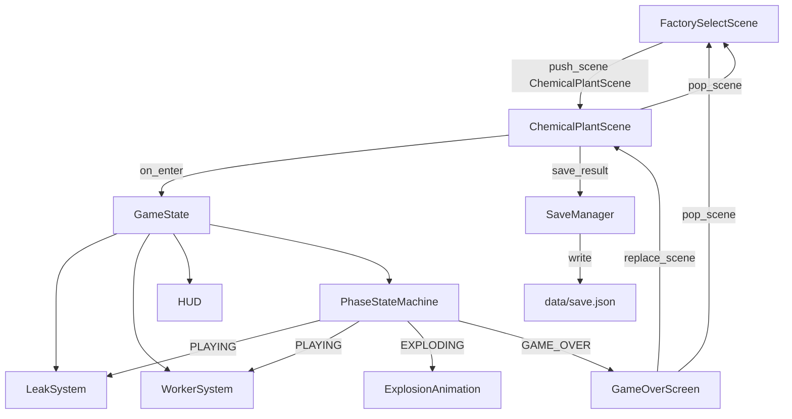
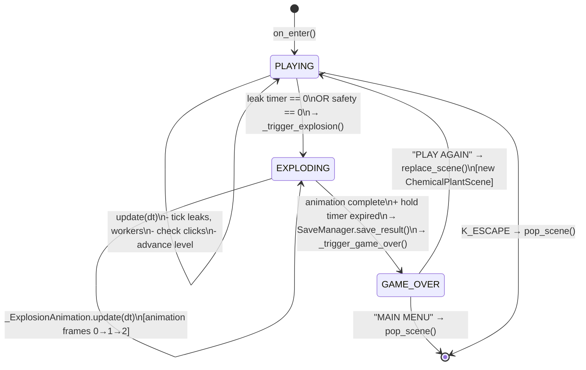

# Design Document — chemical-plant-gameplay

## Overview

`ChemicalPlantScene` replaces `GamePlaceholderScene` for `factory_id = "chemical"`. It is a
single-screen, real-time mini-game where the player simultaneously manages gas leak detection
(click hazards before they explode) and PPE assignment (assign respirators to workers before
they enter the plant unprotected). The scene runs through three progressive difficulty levels
and ends with an explosion animation, a game-over screen, and a save to `data/save.json`.

All rendering uses `pygame.draw` + `pygame.font.SysFont`. All constants live in `settings.py`.
All time-based logic uses `dt` (seconds). Save I/O is exclusively through `core/save_manager.py`.

---

## Architecture



### Module layout

| Path | Purpose |
|---|---|
| `scenes/chemical_plant.py` | `ChemicalPlantScene` + private helpers `_LeakSpot`, `_Worker`, `_ExplosionAnimation`, `_GameOverScreen` |
| `core/save_manager.py` | `SaveManager` — sole owner of `data/save.json` |
| `settings.py` | All new constants (colors, rects, timers, scores) |
| `scenes/factory_select.py` | One-line change: push `ChemicalPlantScene` instead of `GamePlaceholderScene` |

---

## Components and Interfaces

### `ChemicalPlantScene` (scenes/chemical_plant.py)

```python
class ChemicalPlantScene(BaseScene):
    def __init__(self, manager: SceneManager, input_handler: InputHandler,
                 factory_data: dict): ...

    # Lifecycle
    def on_enter(self) -> None: ...   # init all state, fonts, save_manager
    def on_exit(self) -> None: ...    # clear all state references

    # Frame loop
    def handle_event(self, event: pygame.event.Event) -> None: ...
    def update(self, dt: float) -> None: ...
    def draw(self, surface: pygame.Surface) -> None: ...

    # Private helpers
    def _spawn_leak(self) -> None: ...
    def _resolve_leak(self, leak: "_LeakSpot") -> None: ...
    def _advance_level(self) -> None: ...
    def _trigger_explosion(self, pos: tuple[int, int]) -> None: ...
    def _trigger_game_over(self) -> None: ...
    def _draw_hud(self, surface: pygame.Surface) -> None: ...
    def _draw_floor(self, surface: pygame.Surface) -> None: ...
    def _draw_staging(self, surface: pygame.Surface) -> None: ...
    def _calc_grade(self) -> str: ...          # pure: SafetyMeter → "A"/"B"/"C"/"F"
    def _meter_bar_width(self, pct: float, max_w: int) -> int: ...  # pure: pct/100 * max_w
```

**State fields (set in `on_enter`, cleared in `on_exit`):**

| Field | Type | Description |
|---|---|---|
| `_phase` | `str` | `"PLAYING"` / `"EXPLODING"` / `"GAME_OVER"` |
| `_level` | `int` | 1–3 |
| `_level_timer` | `float` | seconds elapsed in current level |
| `_score` | `int` | cumulative score |
| `_safety` | `float` | 0.0–100.0 |
| `_production` | `float` | 0.0–100.0 |
| `_leaks` | `list[_LeakSpot]` | active leak spots |
| `_workers` | `list[_Worker]` | staging area queue |
| `_selected_worker` | `_Worker \| None` | currently selected worker |
| `_worker_timer` | `float` | countdown to next worker spawn |
| `_time_survived` | `float` | total seconds survived |
| `_level_up_timer` | `float` | countdown for "LEVEL UP!" display (0 = hidden) |
| `_explosion` | `_ExplosionAnimation \| None` | active explosion |
| `_game_over_screen` | `_GameOverScreen \| None` | active game-over overlay |
| `_save_manager` | `SaveManager` | injected in `on_enter` |
| `_fonts` | `dict[str, pygame.font.Font]` | keyed by role |

---

### `_LeakSpot`

```python
class _LeakSpot:
    def __init__(self, pos: tuple[int, int], duration: float): ...

    pos: tuple[int, int]          # centre of the leak circle
    remaining: float              # seconds until explosion
    duration: float               # original timer (for progress bar ratio)
    hit_radius: int               # from settings: LEAK_HIT_RADIUS

    def update(self, dt: float) -> bool: ...   # returns True if timer expired
    def contains_point(self, pt: tuple[int, int]) -> bool: ...
    def draw(self, surface: pygame.Surface) -> None: ...
```

---

### `_Worker`

```python
class _Worker:
    def __init__(self, queue_index: int): ...

    queue_index: int              # position in staging queue (0 = front)
    protected: bool               # True after respirator assigned
    selected: bool                # True while player has clicked this worker

    def draw(self, surface: pygame.Surface, x: int, y: int) -> None: ...
    # delegates to core.placeholder_sprites.draw_worker with factory_id="chemical"
```

---

### `_ExplosionAnimation`

```python
class _ExplosionAnimation:
    def __init__(self, pos: tuple[int, int]): ...

    pos: tuple[int, int]
    elapsed: float                # seconds since animation started
    frame: int                    # 0, 1, 2 — derived from elapsed

    def update(self, dt: float) -> bool: ...   # returns True when complete
    def draw(self, surface: pygame.Surface) -> None: ...
    # draws expanding concentric rings via pygame.draw.circle
```

Frame index: `frame = min(2, int(elapsed / EXPLOSION_FRAME_DURATION_S))`
where `EXPLOSION_FRAME_DURATION_S = EXPLOSION_FRAME_DURATION / 1000.0`.

---

### `_GameOverScreen`

```python
class _GameOverScreen:
    def __init__(self, score: int, level: int, time_survived: float,
                 grade: str, fonts: dict): ...

    def handle_click(self, pos: tuple[int, int]) -> str | None:
        # returns "play_again" | "main_menu" | None

    def draw(self, surface: pygame.Surface) -> None: ...
```

---

### `SaveManager` (core/save_manager.py)

```python
import json, os
from pathlib import Path

SAVE_PATH = Path("data/save.json")

class SaveManager:
    def save_result(self, result: dict) -> None:
        """Append result to data/save.json, creating file/dir as needed."""
        ...

    def load_results(self) -> list[dict]:
        """Return all saved results (empty list if file absent)."""
        ...
```

`save_result` algorithm:
1. `SAVE_PATH.parent.mkdir(parents=True, exist_ok=True)`
2. Load existing list (empty list if file missing or malformed)
3. Append `result`
4. Write back with `json.dump(..., indent=2)`

---

### `scenes/factory_select.py` change

Inside `FactorySelectScene.update`, replace:

```python
from scenes.game_placeholder import GamePlaceholderScene
self.manager.push_scene(GamePlaceholderScene(self.manager, self.input, card.factory_id))
```

with:

```python
if card.factory_id == "chemical":
    from scenes.chemical_plant import ChemicalPlantScene
    factory_data = next(f for f in FACTORIES if f["id"] == card.factory_id)
    self.manager.push_scene(ChemicalPlantScene(self.manager, self.input, factory_data))
else:
    from scenes.game_placeholder import GamePlaceholderScene
    self.manager.push_scene(GamePlaceholderScene(self.manager, self.input, card.factory_id))
```

---

## Data Models

### Result dict (passed to `SaveManager.save_result`)

```python
{
    "factory_id":     str,    # always "chemical"
    "score":          int,    # final score >= 0
    "level_reached":  int,    # 1, 2, or 3
    "time_survived":  float,  # total seconds
    "grade":          str,    # "A", "B", "C", or "F"
}
```

### Difficulty settings (per level)

| Constant | Level 1 | Level 2 | Level 3 |
|---|---|---|---|
| `LEAK_MAX_SIMULTANEOUS` | 1 | 2 | 3 |
| `LEAK_TIMER_EASY` | 8.0 s | — | — |
| `LEAK_TIMER_MEDIUM` | — | 5.0 s | — |
| `LEAK_TIMER_HARD` | — | — | 3.0 s |
| `WORKER_INTERVAL_EASY` | 15.0 s | — | — |
| `WORKER_INTERVAL_MEDIUM` | — | 10.0 s | — |
| `WORKER_INTERVAL_HARD` | — | — | 6.0 s |

Level-indexed lookup helpers (used inside the scene):

```python
_LEAK_TIMERS    = [LEAK_TIMER_EASY, LEAK_TIMER_MEDIUM, LEAK_TIMER_HARD]
_WORKER_INTERVALS = [WORKER_INTERVAL_EASY, WORKER_INTERVAL_MEDIUM, WORKER_INTERVAL_HARD]
_LEAK_MAX       = [1, 2, 3]   # index = level - 1
```

---

## settings.py Additions

```python
# ── Chemical Plant — Layout ────────────────────────────────────────────────────
HUD_HEIGHT = 60                          # px; top strip height

# Factory floor zones (x, y, w, h) — positioned below HUD, above staging
ZONE_REACTOR = (40,   HUD_HEIGHT + 20, 340, 260)
ZONE_STORAGE = (460,  HUD_HEIGHT + 20, 340, 260)
ZONE_MIXING  = (880,  HUD_HEIGHT + 20, 340, 260)

# Staging area — bottom strip
STAGING_AREA_RECT = (0, 580, 1280, 140)

# ── Chemical Plant — Colors ────────────────────────────────────────────────────
COLOR_PLANT_BG         = (28, 32, 36)       # dark charcoal
COLOR_PLANT_GRID       = (40, 46, 52)       # subtle grid lines
COLOR_ZONE_REACTOR     = (80, 30, 30)       # deep red tint
COLOR_ZONE_STORAGE     = (30, 60, 80)       # deep blue tint
COLOR_ZONE_MIXING      = (30, 70, 40)       # deep green tint
COLOR_ZONE_LABEL       = (200, 200, 200)    # zone label text
COLOR_STAGING_BG       = (22, 27, 34)       # staging strip background
COLOR_STAGING_LABEL    = (139, 148, 158)    # muted label

COLOR_SAFETY_BAR       = (60, 200, 100)     # green safety meter fill
COLOR_PRODUCTION_BAR   = (240, 192, 64)     # yellow production meter fill
COLOR_HUD_BG           = (13, 17, 23)       # HUD strip background
COLOR_HUD_TEXT         = (230, 237, 243)    # HUD labels

COLOR_LEAK_CIRCLE      = (255, 160, 0)      # orange leak indicator
COLOR_LEAK_TIMER_BAR   = (255, 80, 0)       # red countdown bar
COLOR_LEAK_TIMER_BG    = (60, 60, 60)       # countdown bar background

COLOR_WORKER_SELECTED  = (240, 192, 64)     # highlight ring around selected worker
COLOR_ASSIGN_BTN       = (60, 200, 100)     # "Assign Respirator" button fill
COLOR_ASSIGN_BTN_TEXT  = (13, 17, 23)       # button label

COLOR_EXPLOSION_INNER  = (255, 160, 0)      # orange inner ring
COLOR_EXPLOSION_OUTER  = (220, 40, 40)      # red outer ring
COLOR_EXPLOSION_TEXT   = (255, 255, 255)    # "EXPLOSION!" text

COLOR_GAME_OVER_BG     = (13, 17, 23)       # game-over overlay background
COLOR_GRADE_A          = (60, 200, 100)
COLOR_GRADE_B          = (240, 192, 64)
COLOR_GRADE_C          = (240, 140, 40)
COLOR_GRADE_F          = (220, 60, 60)

COLOR_LEVEL_UP_TEXT    = (240, 192, 64)     # "LEVEL UP!" notification

# ── Chemical Plant — Leak mechanic ────────────────────────────────────────────
LEAK_HIT_RADIUS        = 24              # px; click detection radius
LEAK_CIRCLE_RADIUS     = 18             # px; drawn circle radius
LEAK_TIMER_BAR_W       = 48             # px; width of countdown bar
LEAK_TIMER_BAR_H       = 6              # px; height of countdown bar
LEAK_TIMER_EASY        = 8.0            # seconds (Level 1)
LEAK_TIMER_MEDIUM      = 5.0            # seconds (Level 2)
LEAK_TIMER_HARD        = 3.0            # seconds (Level 3)
LEAK_MAX_SIMULTANEOUS  = 3              # absolute max (Level 3 value; used as list cap)

# ── Chemical Plant — Worker mechanic ──────────────────────────────────────────
WORKER_INTERVAL_EASY   = 15.0           # seconds between spawns (Level 1)
WORKER_INTERVAL_MEDIUM = 10.0           # seconds between spawns (Level 2)
WORKER_INTERVAL_HARD   = 6.0            # seconds between spawns (Level 3)
WORKER_SPACING         = 80             # px; horizontal gap between workers in staging
WORKER_STAGING_Y       = 650            # px; vertical centre of workers in staging
ASSIGN_BTN_W           = 200            # px
ASSIGN_BTN_H           = 36             # px
ASSIGN_BTN_X           = 1060           # px; left edge of button
ASSIGN_BTN_Y           = 670            # px; top edge of button

# ── Chemical Plant — Scoring ───────────────────────────────────────────────────
SCORE_LEAK_RESOLVED         = 100
SCORE_WORKER_PROTECTED      = 50
SAFETY_PENALTY_UNPROTECTED_WORKER = 10.0   # percentage points

# ── Chemical Plant — Difficulty / progression ─────────────────────────────────
LEVEL_ADVANCE_DURATION      = 60.0      # seconds per level
LEVEL_UP_DISPLAY_DURATION   = 2.0       # seconds "LEVEL UP!" is shown
PRODUCTION_RATE             = 5.0       # % per second

# ── Chemical Plant — Explosion animation ──────────────────────────────────────
EXPLOSION_FRAME_DURATION    = 133       # ms per frame  (400 / 3 ≈ 133)
EXPLOSION_TOTAL_DURATION    = 400       # ms total
EXPLOSION_TEXT_HOLD_DURATION = 1.0     # seconds pause after animation before game-over

# ── Chemical Plant — HUD bar geometry ─────────────────────────────────────────
HUD_BAR_W        = 200    # px; max width of each meter bar
HUD_BAR_H        = 16     # px; height of each meter bar
HUD_BAR_MARGIN   = 8      # px; gap between bar bg and fill
```

---

## Data Flow Per Frame

```mermaid
sequenceDiagram
    participant ML as main.py loop
    participant IH as InputHandler
    participant CPS as ChemicalPlantScene
    participant LS as _LeakSpot list
    participant WS as _Worker list
    participant EA as _ExplosionAnimation
    participant GOS as _GameOverScreen

    ML->>IH: update(events)
    ML->>CPS: handle_event(event) [per event]
    ML->>CPS: update(dt)

    alt phase == PLAYING
        CPS->>LS: update each leak (dt)
        CPS->>WS: check worker timer, spawn if due
        CPS->>CPS: check click → resolve leak / select worker / assign respirator
        CPS->>CPS: update level_timer, advance level if due
        CPS->>CPS: update production meter
        CPS->>CPS: check safety == 0 → trigger_game_over
    else phase == EXPLODING
        CPS->>EA: update(dt)
        EA-->>CPS: complete? → hold timer
        CPS->>CPS: hold_timer -= dt; if <= 0 → trigger_game_over
    else phase == GAME_OVER
        CPS->>GOS: handle_click if mouse clicked
        GOS-->>CPS: "play_again" | "main_menu" | None
    end

    ML->>CPS: draw(surface)
    CPS->>CPS: _draw_floor(surface)
    CPS->>CPS: _draw_staging(surface)
    CPS->>LS: draw each leak
    CPS->>WS: draw each worker
    CPS->>CPS: _draw_hud(surface)

    alt phase == EXPLODING or GAME_OVER
        CPS->>EA: draw(surface)
    end
    alt phase == GAME_OVER
        CPS->>GOS: draw(surface)
    end
```

---

## State Machine



### Phase transition rules

| From | To | Trigger | Action |
|---|---|---|---|
| `PLAYING` | `EXPLODING` | `leak.remaining <= 0` or `safety <= 0` | Create `_ExplosionAnimation(pos)`, set `_phase = "EXPLODING"`, freeze production |
| `EXPLODING` | `GAME_OVER` | `explosion.update()` returns `True` AND hold timer expires | Call `save_manager.save_result(...)`, create `_GameOverScreen`, set `_phase = "GAME_OVER"` |
| `GAME_OVER` | *(new scene)* | "PLAY AGAIN" clicked | `self.manager.replace_scene(ChemicalPlantScene(...))` |
| `GAME_OVER` | *(pop)* | "MAIN MENU" clicked | `self.manager.pop_scene()` |
| `PLAYING` | *(pop)* | `K_ESCAPE` | `self.manager.pop_scene()` |

---

## Correctness Properties

*A property is a characteristic or behavior that should hold true across all valid executions of a system — essentially, a formal statement about what the system should do. Properties serve as the bridge between human-readable specifications and machine-verifiable correctness guarantees.*

### Property 1: LeakSpot spawn position is always inside a FactoryZone

*For any* call to `_spawn_leak()`, the returned position `(x, y)` must satisfy `zone_rect.collidepoint(x, y)` for exactly one of `ZONE_REACTOR`, `ZONE_STORAGE`, or `ZONE_MIXING`.

**Validates: Requirements 4.1**

---

### Property 2: Active leak count never exceeds the level cap

*For any* sequence of spawn, resolve, and expire events, `len(active_leaks) <= LEAK_MAX_SIMULTANEOUS` for the current level must hold after every update step.

**Validates: Requirements 4.2**

---

### Property 3: LeakSpot timer decrements by exactly dt

*For any* `_LeakSpot` with `remaining = t` and any `dt > 0`, after `leak.update(dt)` the new `remaining` equals `max(0.0, t - dt)`.

**Validates: Requirements 4.4**

---

### Property 4: Resolving a leak adds exactly SCORE_LEAK_RESOLVED to the score

*For any* active `_LeakSpot` and any click position within `LEAK_HIT_RADIUS` of the leak's centre, calling `_resolve_leak(leak)` increases `_score` by exactly `SCORE_LEAK_RESOLVED` and removes the leak from `_leaks`.

**Validates: Requirements 4.5, 11.1**

---

### Property 5: Worker spawns after accumulating WORKER_INTERVAL seconds

*For any* sequence of `dt` values whose sum reaches or exceeds the current level's `WORKER_INTERVAL`, exactly one new `_Worker` is appended to `_workers` and the spawn timer resets.

**Validates: Requirements 5.1**

---

### Property 6: Assigning a respirator removes the worker and adds SCORE_WORKER_PROTECTED

*For any* `_Worker` in `_workers` that is selected, after the "Assign Respirator" action `_score` increases by exactly `SCORE_WORKER_PROTECTED` and the worker is no longer in `_workers`.

**Validates: Requirements 5.4, 11.2**

---

### Property 7: Unprotected worker exit reduces SafetyMeter by SAFETY_PENALTY_UNPROTECTED_WORKER

*For any* `SafetyMeter` value `s` in `[0.0, 100.0]`, when an unprotected worker exits the queue the new safety value equals `max(0.0, s - SAFETY_PENALTY_UNPROTECTED_WORKER)`.

**Validates: Requirements 5.5**

---

### Property 8: Level advances after LEVEL_ADVANCE_DURATION, capped at 3

*For any* current level `l` in `{1, 2}`, when `level_timer >= LEVEL_ADVANCE_DURATION` the level becomes `l + 1` and `level_timer` resets to `0`. *For any* current level `l = 3`, the level remains `3` regardless of `level_timer`.

**Validates: Requirements 6.4, 6.5**

---

### Property 9: ProductionMeter update follows the clamped rate formula

*For any* `ProductionMeter` value `p` in `[0.0, 100.0]` and any `dt > 0` while in `PLAYING` phase, after `update(dt)` the new production value equals `min(100.0, p + PRODUCTION_RATE * dt)`.

**Validates: Requirements 7.1, 7.2**

---

### Property 10: ExplosionAnimation selects the correct frame for any elapsed time

*For any* elapsed time `e` in `[0, EXPLOSION_TOTAL_DURATION / 1000.0]`, the frame index equals `min(2, int(e / (EXPLOSION_FRAME_DURATION / 1000.0)))`, always in `{0, 1, 2}`.

**Validates: Requirements 8.2**

---

### Property 11: Grade calculation is correct for any SafetyMeter value

*For any* `SafetyMeter` value `s` in `[0.0, 100.0]`, `_calc_grade()` returns:
- `"A"` if `s >= 90`
- `"B"` if `70 <= s < 90`
- `"C"` if `50 <= s < 70`
- `"F"` if `s < 50`

**Validates: Requirements 9.2**

---

### Property 12: SaveManager round-trip preserves all required result fields

*For any* result dict containing `factory_id`, `score`, `level_reached`, `time_survived`, and `grade` with valid values, after `save_result(result)` a subsequent `load_results()` call returns a list whose last entry equals the saved dict and contains all five required keys.

**Validates: Requirements 10.1, 10.2, 10.3, 10.4, 10.6**

---

### Property 13: HUD meter bar width is proportional to meter percentage

*For any* meter percentage `pct` in `[0.0, 100.0]` and max bar width `max_w`, `_meter_bar_width(pct, max_w)` returns `int(pct / 100.0 * max_w)`, always in `[0, max_w]`.

**Validates: Requirements 3.7**

---

## Error Handling

| Scenario | Handling |
|---|---|
| `data/` directory missing | `SaveManager.save_result` calls `Path.mkdir(parents=True, exist_ok=True)` before writing |
| `data/save.json` missing or corrupt | `load_results` catches `FileNotFoundError` and `json.JSONDecodeError`, returns `[]` |
| Click outside all leaks and workers | No-op; no state change |
| `_spawn_leak` called when at max simultaneous | Guard: `if len(self._leaks) >= _LEAK_MAX[self._level - 1]: return` |
| `SafetyMeter` goes below 0 | Clamped to `max(0.0, ...)` before assignment; triggers game-over at exactly 0 |
| `ProductionMeter` exceeds 100 | Clamped to `min(100.0, ...)` |
| `on_exit` called before `on_enter` | All state fields default to `None`; `on_exit` guards with `if self._field is not None` |

---

## Testing Strategy

### Property-based testing (Hypothesis)

The feature has clear pure-function logic suitable for property-based testing. Use **Hypothesis** (`pip install hypothesis`).

Each property test runs a minimum of 100 iterations. Tag format in comments:
`# Feature: chemical-plant-gameplay, Property N: <property_text>`

Target functions for property tests (all pure / easily isolated):

| Property | Target | Hypothesis strategy |
|---|---|---|
| P1 — spawn inside zone | `_spawn_leak` position | `st.integers` for zone selection |
| P2 — leak count cap | update loop with mock | `st.lists` of events |
| P3 — timer decrement | `_LeakSpot.update` | `st.floats(min_value=0.001, max_value=20.0)` |
| P4 — resolve score delta | `_resolve_leak` | `st.integers` for initial score |
| P5 — worker spawn timing | worker timer logic | `st.lists(st.floats(...))` summing to interval |
| P6 — assign score delta | assign action | `st.integers` for initial score |
| P7 — safety penalty | safety update | `st.floats(0.0, 100.0)` |
| P8 — level advance | level timer logic | `st.integers(1, 3)`, `st.floats` |
| P9 — production formula | production update | `st.floats(0.0, 100.0)`, `st.floats(0.001, 5.0)` |
| P10 — explosion frame | `_ExplosionAnimation` frame calc | `st.floats(0.0, EXPLOSION_TOTAL_DURATION/1000)` |
| P11 — grade calc | `_calc_grade` | `st.floats(0.0, 100.0)` |
| P12 — save round-trip | `SaveManager` | `st.fixed_dictionaries(...)` with tmp_path |
| P13 — bar width | `_meter_bar_width` | `st.floats(0.0, 100.0)`, `st.integers(1, 500)` |

### Unit / example-based tests

- Scene pushes `ChemicalPlantScene` (not `GamePlaceholderScene`) when `factory_id == "chemical"`
- `K_ESCAPE` calls `pop_scene()`
- `SafetyMeter == 0` triggers `EXPLODING` phase
- `EXPLODING` → `GAME_OVER` transition after hold timer
- "PLAY AGAIN" calls `replace_scene`, "MAIN MENU" calls `pop_scene`
- `save_result` called exactly once before `_GameOverScreen` is shown

### Integration tests

- `SaveManager` creates `data/` directory when absent (filesystem test with `tmp_path`)
- Full `on_enter` → `update` → `on_exit` cycle does not raise (smoke test with mocked pygame)
