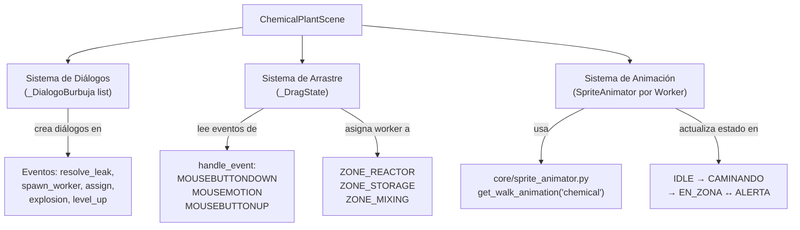
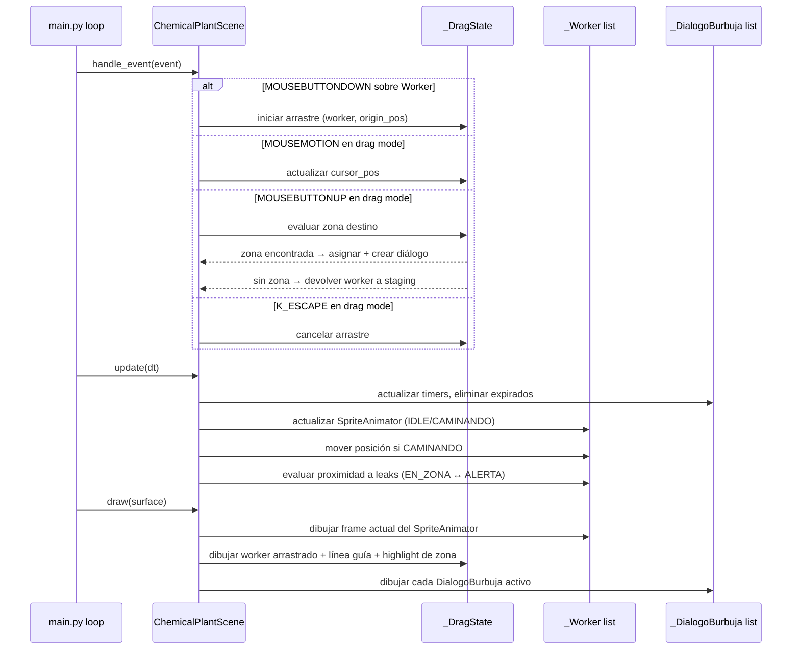

# Documento de Diseño — chemical-plant-ux-improvements

## Visión general

Este documento describe el diseño técnico para añadir tres capas de UX a `ChemicalPlantScene`:

1. **Diálogos contextuales en español** — burbujas de texto flotantes con fondo semi-transparente que informan al jugador sobre eventos del juego.
2. **Asignación por arrastre (drag-and-drop)** — el jugador arrastra un `Worker` desde el `StagingArea` hasta una `FactoryZone` para asignarle un respirador.
3. **Animación de personajes** — los `Worker` tienen estados `IDLE`, `CAMINANDO`, `EN_ZONA` y `ALERTA`, cada uno con comportamiento visual distinto usando `SpriteAnimator`.

Toda la lógica nueva vive en `scenes/chemical_plant.py`. Todas las constantes nuevas van en `settings.py`. No se usan archivos de imagen; todo se dibuja con `pygame.draw` y `pygame.font.SysFont`.

---

## Arquitectura

Las tres mejoras se integran como capas adicionales sobre la arquitectura existente de `ChemicalPlantScene`. No se crean nuevos módulos; se extienden las clases privadas `_Worker` y la escena principal.



### Flujo de datos por frame (extensión del diseño existente)



---

## Componentes e interfaces

### `_DialogoBurbuja` (nuevo, en `scenes/chemical_plant.py`)

Mensaje flotante con duración limitada. Se crea en respuesta a eventos del juego.

```python
class _DialogoBurbuja:
    def __init__(self, text: str, pos: tuple[int, int], duration: float) -> None:
        self.text = text
        self.pos = pos                  # (x, y) centro del diálogo
        self.remaining: float = duration

    def update(self, dt: float) -> bool:
        """Decrementa el timer. Retorna True cuando expira."""
        self.remaining = max(0.0, self.remaining - dt)
        return self.remaining <= 0.0

    def draw(self, surface: pygame.Surface, font: pygame.font.Font) -> None:
        """Dibuja texto sobre rectángulo semi-transparente redondeado."""
        ...
```

**Método de creación centralizado en `ChemicalPlantScene`:**

```python
def _create_dialog(self, text: str, pos: tuple[int, int]) -> None:
    """Crea un _DialogoBurbuja, aplicando offset vertical si hay colisión de posición."""
    ...
```

---

### `_DragState` (nuevo, en `scenes/chemical_plant.py`)

Registra el estado del arrastre activo. Es `None` cuando no hay arrastre en curso.

```python
class _DragState:
    def __init__(self, worker: "_Worker", origin_pos: tuple[int, int]) -> None:
        self.worker = worker
        self.origin_pos = origin_pos    # posición original en staging
        self.cursor_pos: tuple[int, int] = origin_pos
```

`ChemicalPlantScene` mantiene `self._drag: _DragState | None`.

---

### `_Worker` (extendido)

Se añaden los campos de animación y estado al `_Worker` existente:

```python
class _Worker:
    def __init__(self, queue_index: int) -> None:
        self.queue_index = queue_index
        self.protected: bool = False
        self.selected: bool = False
        # --- nuevos campos ---
        self.state: str = "IDLE"            # "IDLE" | "CAMINANDO" | "EN_ZONA" | "ALERTA"
        self.pos: tuple[int, int] = (0, 0)  # posición actual en pantalla
        self.target: tuple[int, int] | None = None  # destino cuando CAMINANDO
        self.animator: SpriteAnimator = get_walk_animation("chemical")

    def draw(self, surface: pygame.Surface, x: int, y: int) -> None:
        """Dibuja el frame actual del animator; anillo de alerta si estado == ALERTA."""
        ...
```

---

### `ChemicalPlantScene` — nuevos campos de estado

| Campo | Tipo | Descripción |
|---|---|---|
| `_dialogs` | `list[_DialogoBurbuja]` | Diálogos activos en pantalla |
| `_drag` | `_DragState \| None` | Estado del arrastre activo (`None` = sin arrastre) |

---

### `ChemicalPlantScene` — nuevos métodos privados

| Método | Descripción |
|---|---|
| `_create_dialog(text, pos)` | Crea un `_DialogoBurbuja`, aplica offset vertical si hay colisión |
| `_update_dialogs(dt)` | Decrementa timers, elimina expirados |
| `_draw_dialogs(surface)` | Renderiza todos los diálogos activos |
| `_start_drag(worker, origin)` | Inicia `_DragState` |
| `_end_drag(drop_pos)` | Evalúa zona destino, asigna o devuelve worker |
| `_cancel_drag()` | Cancela arrastre sin asignar |
| `_draw_drag(surface)` | Dibuja worker arrastrado, línea guía y highlight de zona |
| `_update_worker_animation(worker, dt)` | Actualiza `SpriteAnimator` y posición según estado |
| `_update_worker_alert(worker)` | Evalúa proximidad a leaks, cambia entre `EN_ZONA` y `ALERTA` |

---

## Modelos de datos

### `_DialogoBurbuja`

| Campo | Tipo | Descripción |
|---|---|---|
| `text` | `str` | Texto a mostrar (en español) |
| `pos` | `tuple[int, int]` | Centro del diálogo en pantalla |
| `remaining` | `float` | Segundos restantes antes de expirar |

### `_DragState`

| Campo | Tipo | Descripción |
|---|---|---|
| `worker` | `_Worker` | Worker siendo arrastrado |
| `origin_pos` | `tuple[int, int]` | Posición original en staging (para devolver si se cancela) |
| `cursor_pos` | `tuple[int, int]` | Posición actual del cursor |

### Estados de `_Worker`

| Estado | Condición de entrada | Comportamiento visual |
|---|---|---|
| `IDLE` | Recién creado en staging | `SpriteAnimator` activo (walk frames) |
| `CAMINANDO` | Asignado a zona (drag o botón) | `SpriteAnimator` activo, posición se mueve hacia `target` |
| `EN_ZONA` | Llegó a `target` (dentro de `WORKER_ARRIVE_THRESHOLD`) | Sprite estático en posición de zona |
| `ALERTA` | Leak activo dentro de `WORKER_ALERT_RADIUS`, o explosión | Sprite estático + anillo pulsante `COLOR_WORKER_ALERT` |

### Nuevas constantes en `settings.py`

```python
# ── Chemical Plant — UX Improvements ─────────────────────────────────────────

# Diálogos contextuales
DIALOG_DISPLAY_DURATION  = 2.0    # segundos que un diálogo permanece visible
DIALOG_VERTICAL_OFFSET   = 28     # px; desplazamiento vertical para evitar solapamiento
DIALOG_BG_ALPHA          = 180    # 0-255; opacidad del fondo del diálogo
DIALOG_PADDING           = 8      # px; padding interno del rectángulo de fondo
DIALOG_BORDER_RADIUS     = 6      # px; radio de esquinas redondeadas
COLOR_DIALOG_BG          = (20, 24, 30)      # color base del fondo del diálogo
COLOR_DIALOG_TEXT        = (230, 237, 243)   # color del texto del diálogo

# Drag-and-drop
COLOR_ZONE_DROP_HIGHLIGHT = (240, 192, 64)   # color de highlight de zona durante arrastre
COLOR_DRAG_LINE           = (139, 148, 158)  # color de la línea guía durante arrastre
DRAG_LINE_SEGMENT_LEN     = 8               # px; longitud de cada segmento de la línea punteada
DRAG_LINE_GAP_LEN         = 4               # px; longitud del hueco entre segmentos

# Animación de personajes
WORKER_WALK_SPEED         = 120.0  # px/s; velocidad de movimiento hacia zona
WORKER_ARRIVE_THRESHOLD   = 6      # px; distancia para considerar que llegó al destino
WORKER_ALERT_RADIUS       = 100    # px; distancia de detección de fuga para estado ALERTA
COLOR_WORKER_ALERT        = (255, 80, 0)     # color del anillo de alerta
WORKER_ALERT_RING_RADIUS  = 22     # px; radio del anillo de alerta
WORKER_ALERT_RING_WIDTH   = 3      # px; grosor del anillo de alerta
```

---

## Propiedades de corrección

*Una propiedad es una característica o comportamiento que debe ser verdadero en todas las ejecuciones válidas del sistema — esencialmente, una declaración formal sobre lo que el sistema debe hacer. Las propiedades sirven como puente entre las especificaciones legibles por humanos y las garantías de corrección verificables por máquina.*

### Propiedad 1: Diálogo creado en posición del evento

*Para cualquier* evento de juego (fuga resuelta, spawn de worker, asignación, explosión, avance de nivel) con posición `pos`, después de que el evento ocurre, la lista `_dialogs` contiene al menos un `_DialogoBurbuja` cuyo campo `pos` es igual a `pos` (o `pos` desplazado por `DIALOG_VERTICAL_OFFSET` si hay colisión).

**Valida: Requisitos 1.2, 1.3, 1.4, 1.5, 1.6, 1.7**

---

### Propiedad 2: Timer de diálogo decrementa por dt y expira correctamente

*Para cualquier* `_DialogoBurbuja` con `remaining = t` y cualquier `dt > 0`, después de `update(dt)` el nuevo `remaining` es `max(0.0, t - dt)`. Además, para cualquier lista de diálogos, después de `_update_dialogs(dt)`, todos los diálogos con `remaining <= 0` han sido eliminados de la lista.

**Valida: Requisito 1.8**

---

### Propiedad 3: Offset vertical evita solapamiento de diálogos

*Para cualquier* posición `pos` en pantalla donde ya existe un `_DialogoBurbuja` activo, al crear un nuevo diálogo en la misma `pos`, el nuevo diálogo tiene `pos.y` desplazado por al menos `DIALOG_VERTICAL_OFFSET` píxeles respecto al existente.

**Valida: Requisito 1.11**

---

### Propiedad 4: Arrastre sobre zona asigna worker y suma puntuación

*Para cualquier* `_Worker` en staging y cualquier `FactoryZone`, al soltar el worker dentro de la zona (evento `MOUSEBUTTONUP` con cursor dentro del rectángulo de la zona), el score aumenta exactamente en `SCORE_WORKER_PROTECTED` y `_drag` queda en `None`.

**Valida: Requisito 2.4**

---

### Propiedad 5: Arrastre fuera de zona devuelve worker a staging

*Para cualquier* posición de suelta que no esté dentro de ninguna `FactoryZone`, después del evento `MOUSEBUTTONUP`, el worker regresa a su posición original en staging y `_drag` queda en `None`.

**Valida: Requisito 2.5**

---

### Propiedad 6: Todo Worker creado tiene un SpriteAnimator

*Para cualquier* número de workers creados mediante `_Worker(queue_index)`, cada instancia tiene un campo `animator` que es una instancia de `SpriteAnimator`.

**Valida: Requisito 3.1**

---

### Propiedad 7: Worker CAMINANDO se mueve hacia su destino a la velocidad correcta

*Para cualquier* worker con estado `CAMINANDO`, posición `p`, destino `t`, y cualquier `dt > 0`, después de `_update_worker_animation(worker, dt)`, la distancia entre la nueva posición y `t` es menor o igual a la distancia original menos `WORKER_WALK_SPEED * dt` (o cero si ya llegó).

**Valida: Requisito 3.4**

---

### Propiedad 8: Worker llega a destino y transiciona a EN_ZONA

*Para cualquier* worker con estado `CAMINANDO` cuya posición está dentro de `WORKER_ARRIVE_THRESHOLD` píxeles de su `target`, después de `_update_worker_animation(worker, dt)`, el estado del worker es `EN_ZONA`.

**Valida: Requisito 3.5**

---

### Propiedad 9: Proximidad a fuga activa el estado ALERTA

*Para cualquier* worker con estado `EN_ZONA` y cualquier `LeakSpot` activa cuya distancia al worker es menor que `WORKER_ALERT_RADIUS`, después de `_update_worker_alert(worker)`, el estado del worker es `ALERTA`.

*Para cualquier* worker con estado `ALERTA` y ninguna `LeakSpot` activa dentro de `WORKER_ALERT_RADIUS`, después de `_update_worker_alert(worker)`, el estado del worker es `EN_ZONA`.

**Valida: Requisitos 3.7, 3.8**

---

### Propiedad 10: Explosión pone todos los workers en ALERTA

*Para cualquier* lista de workers con cualquier combinación de estados, después de `_trigger_explosion(pos)`, todos los workers tienen estado `ALERTA`.

**Valida: Requisito 3.9**

---

## Manejo de errores

| Escenario | Manejo |
|---|---|
| `_create_dialog` llamado con posición fuera de pantalla | El diálogo se crea igualmente; `draw` lo renderiza en la posición dada (puede quedar parcialmente fuera de pantalla) |
| `_end_drag` llamado sin `_drag` activo | Guard: `if self._drag is None: return` |
| Worker en estado `CAMINANDO` sin `target` | Guard: `if worker.target is None: worker.state = "IDLE"; return` |
| `_update_worker_alert` con `_leaks` vacío | Itera lista vacía sin error; worker en `ALERTA` transiciona a `EN_ZONA` |
| `MOUSEBUTTONUP` fuera de drag mode | No-op; `_drag is None` hace que el handler retorne inmediatamente |
| K_ESCAPE durante drag mode | `_cancel_drag()` restaura worker a staging; `_drag = None` |
| Múltiples diálogos en la misma posición | Cada nuevo diálogo se desplaza `DIALOG_VERTICAL_OFFSET` px hacia arriba respecto al anterior en esa posición |

---

## Estrategia de pruebas

### Pruebas basadas en propiedades (Hypothesis)

Se usa **Hypothesis** (ya instalado en el proyecto). Cada test de propiedad corre mínimo 100 iteraciones. Formato de etiqueta en comentarios:
`# Feature: chemical-plant-ux-improvements, Property N: <texto_propiedad>`

| Propiedad | Función objetivo | Estrategia Hypothesis |
|---|---|---|
| P1 — diálogo en posición del evento | `_create_dialog` | `st.tuples(st.integers(0,1280), st.integers(0,720))` para pos; `st.sampled_from` para tipo de evento |
| P2 — timer decrementa y expira | `_DialogoBurbuja.update` + `_update_dialogs` | `st.floats(0.001, 10.0)` para t y dt |
| P3 — offset vertical evita solapamiento | `_create_dialog` con posición existente | `st.tuples(...)` para pos; verificar `y` desplazado |
| P4 — arrastre sobre zona suma score | `_end_drag` con pos dentro de zona | `st.sampled_from([ZONE_REACTOR, ZONE_STORAGE, ZONE_MIXING])` + `st.integers` para score inicial |
| P5 — arrastre fuera de zona devuelve worker | `_end_drag` con pos fuera de zonas | posiciones generadas fuera de los tres rectángulos |
| P6 — todo Worker tiene SpriteAnimator | `_Worker.__init__` | `st.integers(0, 10)` para queue_index |
| P7 — CAMINANDO mueve a velocidad correcta | `_update_worker_animation` | `st.floats(0.001, 2.0)` para dt; `st.tuples` para pos y target |
| P8 — llegada transiciona a EN_ZONA | `_update_worker_animation` | posición dentro de `WORKER_ARRIVE_THRESHOLD` del target |
| P9 — proximidad activa/desactiva ALERTA | `_update_worker_alert` | `st.floats` para distancia worker-leak respecto a `WORKER_ALERT_RADIUS` |
| P10 — explosión pone todos en ALERTA | `_trigger_explosion` | `st.lists(st.sampled_from(["IDLE","CAMINANDO","EN_ZONA","ALERTA"]))` para estados iniciales |

### Pruebas unitarias / de ejemplo

- El botón "Assign Respirator" sigue funcionando después de añadir drag-and-drop (Requisito 2.6)
- K_ESCAPE durante drag mode cancela el arrastre y devuelve el worker (Requisito 2.9)
- `DIALOG_DISPLAY_DURATION` existe en `settings.py` con valor 2.0 (Requisito 1.10)
- Todas las constantes nuevas son importables desde `settings.py` (Requisito 4.6)
- `draw()` no lanza excepción con diálogos activos, drag activo y workers en todos los estados (Requisitos 1.9, 2.2, 2.3, 2.7, 3.6)

### Pruebas de humo (smoke)

- `on_enter` → `update` × N → `on_exit` no lanza con los nuevos campos inicializados
- `handle_event` procesa `MOUSEBUTTONDOWN`, `MOUSEMOTION`, `MOUSEBUTTONUP` sin lanzar (Requisito 2.8)
- Los tests de humo existentes en `test_chemical_plant_smoke.py` siguen pasando sin modificación

### Compatibilidad con tests existentes

Todos los tests en `tests/test_chemical_plant_properties.py` y `tests/test_chemical_plant_smoke.py` deben seguir pasando sin modificación. Las mejoras de UX son aditivas y no alteran la lógica de puntuación, seguridad, fases ni guardado.
