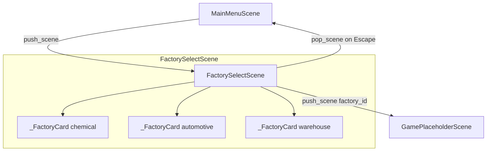

# Design Document — Factory Selection Screen

## Overview

The Factory Selection Screen (`scenes/factory_select.py`) is the scene pushed onto the stack when the player clicks "START GAME" from the Main Menu. It presents three factory cards side-by-side, each showing a worker sprite, factory name, difficulty badge, description, and hazard list. The player clicks a card's SELECT button to push the game scene, or presses Escape to pop back to the Main Menu.

The implementation replaces the existing placeholder in `scenes/factory_select.py` with a fully data-driven, lifecycle-correct scene. All visual constants live in `settings.py`; no magic numbers appear in scene code.

---

## Architecture

The screen follows the established scene pattern: a `BaseScene` subclass (`FactorySelectScene`) owns a list of `_FactoryCard` helper objects. Input flows exclusively through `self.input` (the `InputHandler`). Scene transitions go through `self.manager` (the `SceneManager`).



**Data flow per frame:**

```
main loop
  └─ InputHandler.update(events)
  └─ FactorySelectScene.update(dt)
        ├─ input.get_mouse_pos() → passed to each card.update()
        ├─ input.is_mouse_clicked() → checked against each card.is_select_clicked()
        └─ input.is_key_just_pressed(K_ESCAPE) → pop_scene
  └─ FactorySelectScene.draw(surface)
        └─ card.draw(surface)  [blits pre-rendered surface + live button]
```

---

## Components and Interfaces

### `FACTORIES` (module-level list)

Defined at the top of `scenes/factory_select.py`. Drives all card construction — no per-factory logic anywhere else.

```python
FACTORIES: list[dict] = [
    {
        "id":          "chemical",
        "name":        "Chemical Plant",
        "abbrev":      "CH",
        "color":       (180, 60, 60),
        "difficulty":  "HARD",
        "description": "Hazardous materials, strict PPE required.",
        "hazards":     ["Chemical spills", "Toxic fumes", "PPE violations"],
    },
    {
        "id":          "automotive",
        "name":        "Auto Assembly",
        "abbrev":      "AU",
        "color":       (60, 100, 180),
        "difficulty":  "MEDIUM",
        "description": "Heavy machinery, noise & ergonomics.",
        "hazards":     ["Pinch points", "Noise exposure", "Ergonomic strain"],
    },
    {
        "id":          "warehouse",
        "name":        "Warehouse",
        "abbrev":      "WH",
        "color":       (60, 160, 80),
        "difficulty":  "EASY",
        "description": "Forklift traffic, slip & trip hazards.",
        "hazards":     ["Forklift collisions", "Wet floors", "Unsecured loads"],
    },
]
```

### `_FactoryCard`

Private helper class, defined in the same file. Encapsulates one card's geometry, pre-rendered surface, and hit-testing.

```python
class _FactoryCard:
    def __init__(self, fac: dict, x: int, y: int, w: int, h: int,
                 font_btn, font_body, font_small): ...

    def _build_surface(self, w: int, h: int) -> pygame.Surface:
        """Pre-renders all static content (worker, name, badge, description, hazards)."""
        ...

    def update(self, mouse_pos: tuple[int, int]) -> None:
        """Sets self._hovered based on btn_rect.collidepoint(mouse_pos)."""
        ...

    def is_select_clicked(self, mouse_pos: tuple[int, int], clicked: bool) -> bool:
        """Returns True when clicked is True and mouse_pos is inside btn_rect."""
        ...

    def draw(self, surface: pygame.Surface) -> None:
        """Blits pre-rendered surface, then draws live border and SELECT button."""
        ...

    @property
    def factory_id(self) -> str:
        return self._fac["id"]
```

### `FactorySelectScene`

```python
class FactorySelectScene(BaseScene):
    def on_enter(self) -> None:
        """Allocate fonts, build _FactoryCard list, pre-render title surface."""
        ...

    def on_exit(self) -> None:
        """Nullify all font and surface references."""
        ...

    def handle_event(self, event: pygame.event.Event) -> None:
        pass  # all input via InputHandler

    def update(self, dt: float) -> None:
        """Update hover state, detect clicks and Escape."""
        ...

    def draw(self, surface: pygame.Surface) -> None:
        """Fill background, blit title, draw each card."""
        ...
```

---

## Data Models

### Factory dict schema

| Key | Type | Description |
|---|---|---|
| `id` | `str` | Unique identifier passed to `draw_worker` and game scene |
| `name` | `str` | Display name rendered on card |
| `abbrev` | `str` | Two-letter code (reserved for future use) |
| `color` | `tuple[int,int,int]` | RGB accent color for card theming |
| `difficulty` | `"EASY" \| "MEDIUM" \| "HARD"` | Controls badge color |
| `description` | `str` | One-line environment description |
| `hazards` | `list[str]` | Non-empty list of hazard strings shown on card |

### Difficulty → badge color mapping

Defined as named constants in `settings.py`:

```python
COLOR_DIFFICULTY_EASY   = (60, 200, 100)   # green
COLOR_DIFFICULTY_MEDIUM = (240, 192, 64)   # yellow (reuses COLOR_ACCENT)
COLOR_DIFFICULTY_HARD   = (220, 60, 60)    # red
```

A module-level dict in `factory_select.py` maps difficulty strings to these constants:

```python
_DIFF_COLORS = {
    "EASY":   COLOR_DIFFICULTY_EASY,
    "MEDIUM": COLOR_DIFFICULTY_MEDIUM,
    "HARD":   COLOR_DIFFICULTY_HARD,
}
```

### `settings.py` additions

```python
# Factory Select — card layout
CARD_W            = 280
CARD_H            = 380
CARD_GAP          = 40
CARD_TOP_OFFSET   = 20    # extra downward shift from vertical centre
WORKER_SCALE      = 2.0

# Factory Select — SelectButton
SELECT_BTN_W      = 180
SELECT_BTN_H      = 40
SELECT_BTN_MARGIN = 16    # gap between button bottom and card bottom
```

---

## Correctness Properties

*A property is a characteristic or behavior that should hold true across all valid executions of a system — essentially, a formal statement about what the system should do. Properties serve as the bridge between human-readable specifications and machine-verifiable correctness guarantees.*

### Property 1: FACTORIES data schema invariant

*For any* entry in the `FACTORIES` list, the entry's key set SHALL equal exactly `{"id", "name", "abbrev", "color", "difficulty", "description", "hazards"}`, the `hazards` value SHALL be a non-empty list of strings, and the `color` value SHALL be a tuple of three integers each in the range [0, 255].

**Validates: Requirements 1.2, 1.6, 1.7**

### Property 2: Card layout centring and equal spacing

*For any* screen width, after `FactorySelectScene.on_enter`, the gap between consecutive card rects SHALL be equal, and the entire card group SHALL be horizontally centred on the screen (i.e. left margin equals right margin within one pixel).

**Validates: Requirements 3.1**

### Property 3: Difficulty badge color mapping

*For any* factory entry in `FACTORIES`, the badge color resolved from `_DIFF_COLORS[entry["difficulty"]]` SHALL equal `COLOR_DIFFICULTY_EASY` for `"EASY"`, `COLOR_DIFFICULTY_MEDIUM` for `"MEDIUM"`, and `COLOR_DIFFICULTY_HARD` for `"HARD"`.

**Validates: Requirements 3.4**

### Property 4: Hover state correctness

*For any* `_FactoryCard` and any mouse position, after calling `card.update(mouse_pos)`, `card._hovered` SHALL be `True` if and only if `mouse_pos` is inside `card._btn_rect`.

**Validates: Requirements 4.1, 4.2, 4.3**

### Property 5: Factory selection pushes correct scene

*For any* factory card, when `is_select_clicked` returns `True` and `FactorySelectScene.update` processes it, `manager.push_scene` SHALL be called exactly once with a scene whose `factory_id` attribute equals the clicked card's `factory_id`.

**Validates: Requirements 5.1, 5.2**

---

## Error Handling

| Scenario | Handling |
|---|---|
| `pop_scene` called on empty stack | `SceneManager.pop_scene` already guards with `if not self._stack: return` — no change needed |
| Unknown `factory_id` passed to `draw_worker` | `placeholder_sprites.py` falls back to `"warehouse"` colors — acceptable for alpha |
| `FACTORIES` list modified at runtime | Not expected; list is module-level and treated as read-only |
| `on_exit` called before `on_enter` | All attributes default to `None`; nullifying `None` is a no-op |

---

## Testing Strategy

No test framework is currently configured. The testing strategy below describes what to add once `pytest` is introduced.

### Unit tests (example-based)

- Assert `len(FACTORIES) == 3`
- Assert each factory's `id` and `difficulty` match the spec (1.3, 1.4, 1.5)
- Assert `len(scene._cards) == len(FACTORIES)` after `on_enter`
- Assert `_FactoryCard._surface` is a `pygame.Surface` after construction
- Assert `_btn_rect` bottom is within the lower quarter of the card rect
- Assert `manager.pop_scene` is called when `is_key_just_pressed(K_ESCAPE)` returns `True`
- Assert `SceneManager.pop_scene` on an empty stack raises no exception

### Property-based tests

PBT applies here because several properties hold universally across all entries in `FACTORIES` and across all mouse positions. The recommended library is **Hypothesis** (pure Python, no extra build tooling).

Each property test runs a minimum of 100 iterations.

**Property 1 — FACTORIES schema invariant**
```python
# Feature: factory-select, Property 1: FACTORIES data schema invariant
@given(entry=st.sampled_from(FACTORIES))
def test_factory_schema(entry):
    assert set(entry.keys()) == REQUIRED_KEYS
    assert isinstance(entry["hazards"], list) and len(entry["hazards"]) > 0
    assert all(isinstance(h, str) for h in entry["hazards"])
    r, g, b = entry["color"]
    assert all(0 <= c <= 255 for c in (r, g, b))
```

**Property 2 — Card layout centring and equal spacing**
```python
# Feature: factory-select, Property 2: card layout centring and equal spacing
@given(screen_w=st.integers(min_value=800, max_value=2560))
def test_card_layout_centred(screen_w):
    # Compute card positions using the same formula as on_enter
    total_w = len(FACTORIES) * CARD_W + (len(FACTORIES) - 1) * CARD_GAP
    start_x = (screen_w - total_w) // 2
    rects = [pygame.Rect(start_x + i * (CARD_W + CARD_GAP), 0, CARD_W, CARD_H)
             for i in range(len(FACTORIES))]
    left_margin = rects[0].left
    right_margin = screen_w - rects[-1].right
    assert abs(left_margin - right_margin) <= 1
    for i in range(len(rects) - 1):
        assert rects[i + 1].left - rects[i].right == CARD_GAP
```

**Property 3 — Difficulty badge color mapping**
```python
# Feature: factory-select, Property 3: difficulty badge color mapping
@given(entry=st.sampled_from(FACTORIES))
def test_badge_color_mapping(entry):
    expected = {
        "EASY": COLOR_DIFFICULTY_EASY,
        "MEDIUM": COLOR_DIFFICULTY_MEDIUM,
        "HARD": COLOR_DIFFICULTY_HARD,
    }[entry["difficulty"]]
    assert _DIFF_COLORS[entry["difficulty"]] == expected
```

**Property 4 — Hover state correctness**
```python
# Feature: factory-select, Property 4: hover state correctness
@given(
    mx=st.integers(min_value=0, max_value=1280),
    my=st.integers(min_value=0, max_value=720),
)
def test_hover_state(card, mx, my):
    card.update((mx, my))
    assert card._hovered == card._btn_rect.collidepoint((mx, my))
```

**Property 5 — Factory selection pushes correct scene**
```python
# Feature: factory-select, Property 5: factory selection pushes correct scene
@given(card_index=st.integers(min_value=0, max_value=2))
def test_select_pushes_correct_scene(scene, card_index):
    card = scene._cards[card_index]
    mx, my = card._btn_rect.center
    # Simulate click
    scene._process_click((mx, my), clicked=True)
    pushed = scene.manager.last_pushed
    assert pushed.factory_id == card.factory_id
```
