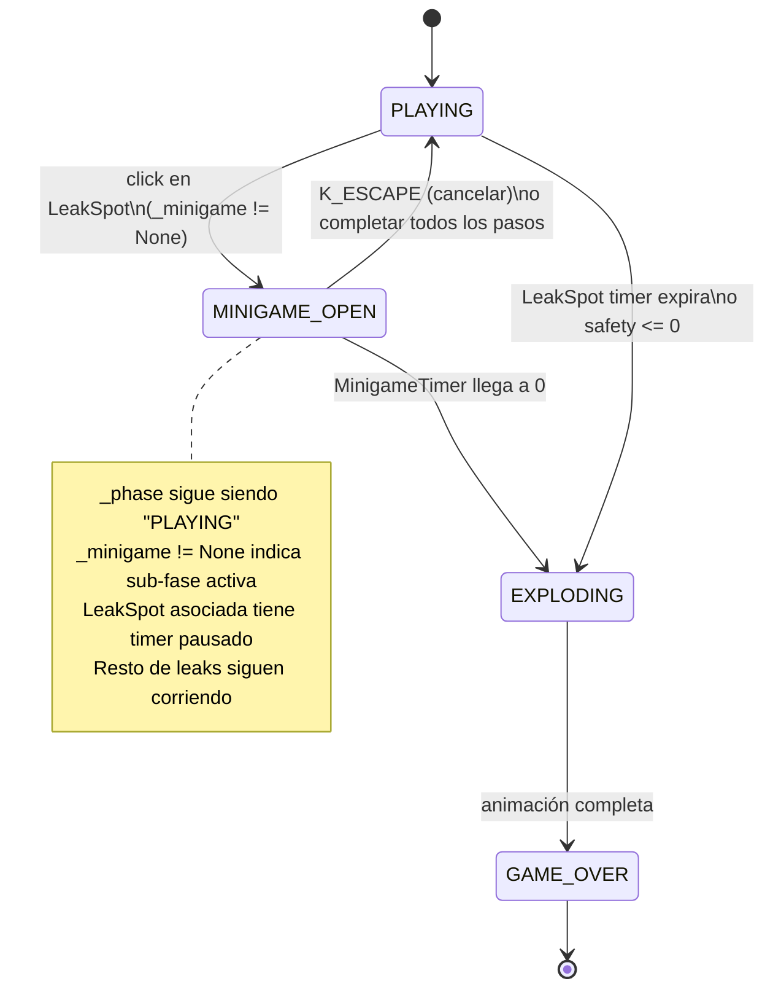
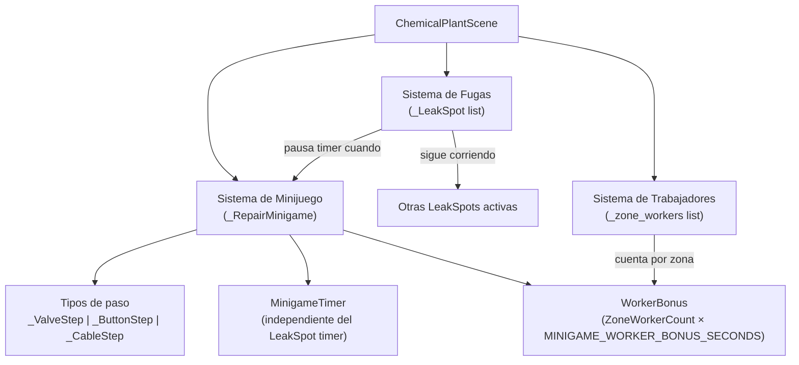
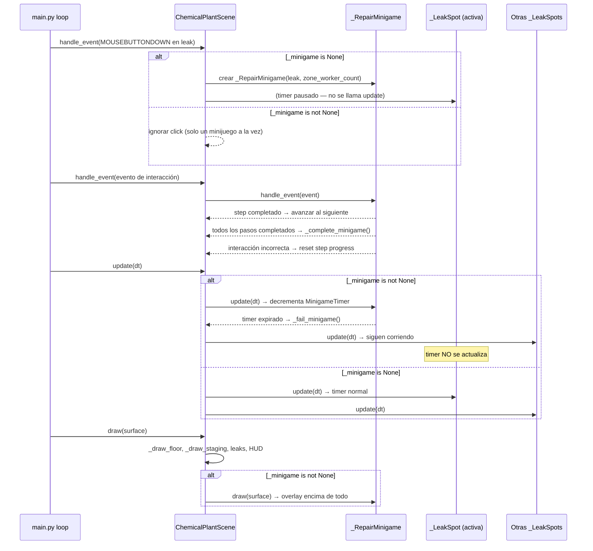

# Documento de Diseño — interactive-repair-minigame

## Visión general

Este documento describe el diseño técnico para reemplazar el mecanismo de click-to-resolve de fugas en `ChemicalPlantScene` por un **minijuego interactivo** estilo "Among Us". Al hacer click en una `_LeakSpot`, se abre un panel overlay `_RepairMinigame` con una secuencia de pasos interactivos que el jugador debe completar antes de que el `MinigameTimer` expire.

El minijuego introduce tres tipos de pasos (`VALVE`, `BUTTON`, `CABLE`), escala en dificultad por nivel (1→2→3 pasos), y los trabajadores asignados a la zona de la fuga otorgan tiempo extra. La fuga se pausa mientras el minijuego está abierto; el `MinigameTimer` corre de forma independiente.

Toda la lógica nueva vive en `scenes/chemical_plant.py`. Todas las constantes nuevas van en `settings.py`. No se usan archivos de imagen; todo se dibuja con `pygame.draw` y `pygame.font.SysFont`.

---

## Arquitectura

El minijuego es una **sub-fase dentro de `PLAYING`**, no una fase separada del ciclo de vida de la escena. La variable `_phase` permanece en `"PLAYING"` durante el minijuego; se añade `_minigame: _RepairMinigame | None` para rastrear si hay un minijuego activo.





### Flujo de datos por frame



---

## Componentes e interfaces

### `_RepairStep` (nuevo, en `scenes/chemical_plant.py`)

Clase base para un paso individual del minijuego.

```python
class _RepairStep:
    step_type: str          # "VALVE" | "BUTTON" | "CABLE"
    completed: bool         # True cuando el paso está terminado

    def handle_event(self, event: pygame.event.Event) -> None: ...
    def reset(self) -> None: ...
    def draw(self, surface: pygame.Surface, panel_rect: pygame.Rect, fonts: dict) -> None: ...
```

#### `_ValveStep`

Requiere `N` clicks en posiciones alrededor de la válvula en orden horario. `N` viene de `VALVE_CLICKS_PER_LEVEL[level-1]`.

```python
class _ValveStep(_RepairStep):
    def __init__(self, n_clicks: int) -> None:
        self.step_type = "VALVE"
        self.n_clicks = n_clicks          # total de clicks requeridos
        self.progress = 0                 # clicks correctos acumulados
        self.completed = False
        self.feedback: str = ""           # "correct" | "error" | ""
        self.feedback_timer: float = 0.0
        # Posiciones de los N puntos alrededor del círculo (calculadas en __init__)
        self._click_targets: list[tuple[int, int]] = []
```

Los `_click_targets` se calculan como N puntos equidistantes en un círculo de radio `VALVE_RADIUS` centrado en el panel. El jugador debe clickear en orden (índice 0, 1, 2, ...). Un click dentro de `VALVE_TARGET_RADIUS` del punto correcto avanza el progreso; cualquier otro click resetea.

#### `_ButtonStep`

Requiere clickear `N` botones numerados en orden ascendente (1, 2, 3, ...).

```python
class _ButtonStep(_RepairStep):
    def __init__(self, n_buttons: int) -> None:
        self.step_type = "BUTTON"
        self.n_buttons = n_buttons
        self.next_expected = 1            # próximo número a clickear
        self.completed = False
        self.feedback: str = ""
        self.feedback_timer: float = 0.0
        self._button_rects: list[pygame.Rect] = []  # calculados en draw()
```

#### `_CableStep`

Requiere conectar `N` pares de cables: click en endpoint izquierdo, luego click en el endpoint derecho del mismo color.

```python
class _CableStep(_RepairStep):
    def __init__(self, n_pairs: int) -> None:
        self.step_type = "CABLE"
        self.n_pairs = n_pairs
        self.connected: list[bool] = [False] * n_pairs
        self.selected_left: int | None = None   # índice del endpoint izquierdo seleccionado
        self.completed = False
        self.feedback: str = ""
        self.feedback_timer: float = 0.0
        self._left_rects: list[pygame.Rect] = []
        self._right_rects: list[pygame.Rect] = []
        self._colors: list[tuple] = []          # color por par
```

---

### `_RepairMinigame` (nuevo, en `scenes/chemical_plant.py`)

Panel overlay principal. Sigue el patrón de `_GameOverScreen`.

```python
class _RepairMinigame:
    def __init__(
        self,
        leak: "_LeakSpot",
        steps: list[_RepairStep],
        timer_duration: float,
        zone_worker_count: int,
    ) -> None:
        self.leak = leak
        self.steps = steps
        self.current_step_index = 0
        self.timer = timer_duration
        self.zone_worker_count = zone_worker_count
        self.completed = False
        self.failed = False
        # Panel rect — centrado en pantalla
        self.panel_rect = pygame.Rect(
            (SCREEN_WIDTH - MINIGAME_PANEL_W) // 2,
            (SCREEN_HEIGHT - MINIGAME_PANEL_H) // 2,
            MINIGAME_PANEL_W,
            MINIGAME_PANEL_H,
        )

    @property
    def current_step(self) -> _RepairStep:
        return self.steps[self.current_step_index]

    def handle_event(self, event: pygame.event.Event) -> None:
        """Delega el evento al paso activo."""
        ...

    def update(self, dt: float) -> None:
        """Decrementa el timer. Avanza al siguiente paso si el actual está completado."""
        ...

    def draw(self, surface: pygame.Surface, fonts: dict) -> None:
        """Dibuja el panel overlay completo."""
        ...
```

---

### `ChemicalPlantScene` — nuevos campos de estado

| Campo | Tipo | Descripción |
|---|---|---|
| `_minigame` | `_RepairMinigame \| None` | Minijuego activo (`None` = sin minijuego) |

---

### `ChemicalPlantScene` — nuevos métodos privados

| Método | Descripción |
|---|---|
| `_open_minigame(leak)` | Crea `_RepairMinigame` para la fuga dada; pausa su timer |
| `_complete_minigame()` | Cierra el panel, elimina la fuga, suma score, reanuda PLAYING |
| `_fail_minigame()` | Cierra el panel, dispara `_trigger_explosion` en la posición de la fuga |
| `_close_minigame()` | Limpia `_minigame = None` (usado por complete y fail) |
| `_build_steps(level)` | Retorna la lista de `_RepairStep` para el nivel dado |
| `_count_zone_workers(leak_pos)` | Cuenta workers en la zona que contiene `leak_pos` |
| `_get_zone_for_pos(pos)` | Retorna el tuple de zona que contiene `pos`, o `None` |
| `_calc_minigame_timer(level, zone_worker_count)` | Calcula la duración efectiva del timer con bonus y cap |

---

## Modelos de datos

### `_RepairMinigame`

| Campo | Tipo | Descripción |
|---|---|---|
| `leak` | `_LeakSpot` | Fuga asociada (su timer está pausado mientras el minijuego está abierto) |
| `steps` | `list[_RepairStep]` | Secuencia de pasos a completar |
| `current_step_index` | `int` | Índice del paso activo (0-based) |
| `timer` | `float` | Segundos restantes del MinigameTimer |
| `zone_worker_count` | `int` | Número de workers en la zona (para mostrar el bonus) |
| `completed` | `bool` | True cuando todos los pasos fueron completados |
| `failed` | `bool` | True cuando el timer llegó a 0 |
| `panel_rect` | `pygame.Rect` | Rectángulo del panel overlay |

### Configuración de pasos por nivel

| Nivel | Pasos | Tipos | Clicks de válvula |
|---|---|---|---|
| 1 | 1 | `[VALVE]` | `VALVE_CLICKS_L1 = 3` |
| 2 | 2 | `[VALVE, BUTTON]` | `VALVE_CLICKS_L2 = 4` |
| 3 | 3 | `[VALVE, BUTTON, CABLE]` | `VALVE_CLICKS_L3 = 5` |

### Fórmula del MinigameTimer efectivo

```
effective_timer = min(
    base_timer[level] + zone_worker_count * MINIGAME_WORKER_BONUS_SECONDS,
    MINIGAME_TIMER_MAX
)
```

Donde `base_timer = [MINIGAME_TIMER_EASY, MINIGAME_TIMER_MEDIUM, MINIGAME_TIMER_HARD]`.

### Nuevas constantes en `settings.py`

```python
# ── Interactive Repair Minigame ───────────────────────────────────────────────

# Panel dimensions
MINIGAME_PANEL_W            = 560    # px; ancho del panel overlay
MINIGAME_PANEL_H            = 400    # px; alto del panel overlay

# Timer base por nivel
MINIGAME_TIMER_EASY         = 12.0   # segundos (Nivel 1)
MINIGAME_TIMER_MEDIUM       = 9.0    # segundos (Nivel 2)
MINIGAME_TIMER_HARD         = 6.0    # segundos (Nivel 3)
MINIGAME_TIMER_MAX          = 20.0   # segundos; cap máximo con bonus de workers

# Worker bonus
MINIGAME_WORKER_BONUS_SECONDS = 3.0  # segundos extra por worker en la zona

# Valve step
VALVE_CLICKS_L1             = 3      # clicks requeridos en Nivel 1
VALVE_CLICKS_L2             = 4      # clicks requeridos en Nivel 2
VALVE_CLICKS_L3             = 5      # clicks requeridos en Nivel 3
VALVE_RADIUS                = 80     # px; radio del círculo de la válvula
VALVE_TARGET_RADIUS         = 18     # px; radio de detección de click en cada punto

# Button step
BUTTON_COUNT_L2             = 4      # número de botones en Nivel 2
BUTTON_COUNT_L3             = 4      # número de botones en Nivel 3
MINIGAME_BTN_W              = 52     # px; ancho de cada botón numerado
MINIGAME_BTN_H              = 52     # px; alto de cada botón numerado
MINIGAME_BTN_GAP            = 12     # px; separación entre botones

# Cable step
CABLE_PAIRS_L3              = 3      # número de pares de cables en Nivel 3
CABLE_ENDPOINT_RADIUS       = 14     # px; radio de cada endpoint de cable
CABLE_ENDPOINT_GAP          = 40     # px; separación vertical entre endpoints

# Feedback
MINIGAME_FEEDBACK_DURATION  = 0.35   # segundos que dura el flash de feedback

# Colors
COLOR_MINIGAME_BG           = (20, 26, 34)      # fondo del panel
COLOR_MINIGAME_BORDER       = (240, 192, 64)    # borde del panel
COLOR_MINIGAME_CORRECT      = (60, 200, 100)    # verde — click correcto
COLOR_MINIGAME_ERROR        = (220, 60, 60)     # rojo — click incorrecto
COLOR_MINIGAME_BONUS        = (240, 192, 64)    # amarillo — label de bonus de workers
COLOR_MINIGAME_TIMER_BAR    = (240, 192, 64)    # barra de timer del minijuego
COLOR_MINIGAME_TIMER_BG     = (50, 50, 50)      # fondo de la barra de timer
COLOR_MINIGAME_STEP_ACTIVE  = (230, 237, 243)   # color del paso activo
COLOR_MINIGAME_STEP_DONE    = (60, 200, 100)    # color del paso completado
COLOR_MINIGAME_VALVE_POINT  = (139, 148, 158)   # punto de válvula sin clickear
COLOR_MINIGAME_CABLE        = (139, 148, 158)   # cable no conectado
```

---

## Propiedades de corrección

*Una propiedad es una característica o comportamiento que debe ser verdadero en todas las ejecuciones válidas del sistema — esencialmente, una declaración formal sobre lo que el sistema debe hacer. Las propiedades sirven como puente entre las especificaciones legibles por humanos y las garantías de corrección verificables por máquina.*

### Propiedad 1: Click en fuga abre minijuego y pausa su timer

*Para cualquier* posición de fuga activa y cualquier punto de click dentro del radio de detección (`LEAK_HIT_RADIUS`), después de procesar el evento `MOUSEBUTTONDOWN`, `_minigame` debe ser no-`None` y el timer de esa fuga específica no debe decrementar durante las llamadas a `update(dt)` mientras `_minigame` esté activo.

**Valida: Requisitos 1.1, 1.2**

---

### Propiedad 2: Otras fugas siguen corriendo mientras el minijuego está abierto

*Para cualquier* lista de fugas activas y cualquier `dt > 0`, mientras `_minigame` está activo, el `remaining` de todas las fugas que no son `_minigame.leak` debe decrementar en exactamente `dt` (o llegar a 0).

**Valida: Requisito 1.3**

---

### Propiedad 3: Solo un minijuego puede estar abierto a la vez

*Para cualquier* escena con `_minigame` ya activo y cualquier click en cualquier otra fuga, después de procesar el evento, `_minigame` debe seguir siendo la misma instancia (no reemplazada).

**Valida: Requisito 1.7**

---

### Propiedad 4: Fórmula del MinigameTimer efectivo con cap

*Para cualquier* nivel (1–3) y cualquier `zone_worker_count ≥ 0`, el timer efectivo calculado por `_calc_minigame_timer(level, zone_worker_count)` debe ser igual a `min(base[level] + zone_worker_count * MINIGAME_WORKER_BONUS_SECONDS, MINIGAME_TIMER_MAX)`, y nunca debe exceder `MINIGAME_TIMER_MAX`.

**Valida: Requisitos 4.3, 4.4**

---

### Propiedad 5: Detección de zona por posición

*Para cualquier* punto `(x, y)` dentro de uno de los tres rectángulos de zona (`ZONE_REACTOR`, `ZONE_STORAGE`, `ZONE_MIXING`), `_get_zone_for_pos((x, y))` debe retornar exactamente esa zona. Para cualquier punto fuera de los tres rectángulos, debe retornar `None`.

**Valida: Requisito 4.6**

---

### Propiedad 6: Configuración de pasos por nivel es correcta y monótona

*Para cualquier* nivel `L ∈ {1, 2, 3}`, `_build_steps(L)` debe retornar exactamente `L` pasos con los tipos `["VALVE"]`, `["VALVE", "BUTTON"]`, `["VALVE", "BUTTON", "CABLE"]` respectivamente. Además, para cualquier par de niveles `L1 < L2`, `len(_build_steps(L1)) ≤ len(_build_steps(L2))`.

**Valida: Requisitos 2.1, 5.1, 5.2, 5.3, 5.5**

---

### Propiedad 7: Completar todos los pasos resuelve la fuga y suma score

*Para cualquier* score inicial y cualquier fuga activa, cuando `_complete_minigame()` es llamado, el score debe incrementar en exactamente `SCORE_LEAK_RESOLVED`, la fuga debe ser eliminada de `_leaks`, y `_minigame` debe ser `None`.

**Valida: Requisitos 3.1, 7.2**

---

### Propiedad 8: MinigameTimer expirado dispara explosión

*Para cualquier* minijuego activo con `timer > 0`, después de llamar `update(dt)` con `dt ≥ timer`, el minijuego debe marcar `failed = True` y `_trigger_explosion` debe ser invocado en la posición de la fuga asociada.

**Valida: Requisito 3.2**

---

### Propiedad 9: Interacción incorrecta resetea el progreso del paso actual a cero

*Para cualquier* `_RepairStep` con `progress > 0` (para `_ValveStep`) o `next_expected > 1` (para `_ButtonStep`) o `selected_left != None` (para `_CableStep`), después de una interacción incorrecta, el progreso del paso debe volver a su estado inicial (0 / 1 / None respectivamente).

**Valida: Requisito 2.6**

---

### Propiedad 10: Completar un paso avanza al siguiente en la secuencia

*Para cualquier* `_RepairMinigame` con `N > 1` pasos y `current_step_index = k < N-1`, cuando el paso `k` se marca como `completed`, `current_step_index` debe avanzar a `k+1`.

**Valida: Requisito 2.5**

---

## Manejo de errores

| Escenario | Manejo |
|---|---|
| Click en fuga con `_minigame` ya activo | Guard en `handle_event`: `if self._minigame is not None: return` antes de abrir nuevo minijuego |
| `_complete_minigame()` llamado sin `_minigame` activo | Guard: `if self._minigame is None: return` |
| `_fail_minigame()` llamado sin `_minigame` activo | Guard: `if self._minigame is None: return` |
| Fuga asociada al minijuego ya no está en `_leaks` (edge case de timing) | `_complete_minigame` usa `if leak in self._leaks` antes de remover |
| `_get_zone_for_pos` con posición fuera de todas las zonas | Retorna `None`; `_count_zone_workers` retorna 0 si zona es `None` |
| `_build_steps` llamado con nivel fuera de rango | Clamp: `level = max(1, min(3, level))` |
| `_ValveStep` con click fuera de todos los targets | Resetea progreso a 0 (interacción incorrecta) |
| `_CableStep` con click en endpoint derecho sin endpoint izquierdo seleccionado | No-op; `selected_left is None` hace que el handler retorne |
| K_ESCAPE durante minijuego | `_close_minigame()` sin resolver la fuga; timer de la fuga se reanuda |
| MinigameTimer llega a 0 exactamente en el mismo frame que se completa el último paso | Completar tiene prioridad: `update()` verifica `current_step.completed` antes de decrementar el timer |

---

## Estrategia de pruebas

### Pruebas basadas en propiedades (Hypothesis)

Se usa **Hypothesis** (ya instalado en el proyecto). Cada test de propiedad corre mínimo 100 iteraciones. Formato de etiqueta en comentarios:
`# Feature: interactive-repair-minigame, Property N: <texto_propiedad>`

| Propiedad | Función objetivo | Estrategia Hypothesis |
|---|---|---|
| P1 — click en fuga abre minijuego y pausa timer | `_open_minigame` + `update` | `st.tuples(st.integers, st.integers)` para pos de fuga; `st.floats(0.001, 5.0)` para dt |
| P2 — otras fugas siguen corriendo | `update` con `_minigame` activo | `st.lists` de fugas con timers aleatorios; `st.floats(0.001, 2.0)` para dt |
| P3 — solo un minijuego a la vez | `handle_event` con `_minigame` activo | `st.integers` para posiciones de fugas adicionales |
| P4 — fórmula del timer efectivo con cap | `_calc_minigame_timer` | `st.integers(1,3)` para nivel; `st.integers(0,10)` para worker count |
| P5 — detección de zona por posición | `_get_zone_for_pos` | `st.integers` para x,y dentro/fuera de zonas |
| P6 — configuración de pasos por nivel | `_build_steps` | `st.integers(1,3)` para nivel; verificar count y tipos |
| P7 — completar minijuego suma score y elimina fuga | `_complete_minigame` | `st.integers(0, 100_000)` para score inicial |
| P8 — timer expirado dispara explosión | `_RepairMinigame.update` | `st.floats(0.001, 15.0)` para timer inicial; dt ≥ timer |
| P9 — interacción incorrecta resetea progreso | `_ValveStep.handle_event`, `_ButtonStep.handle_event`, `_CableStep.handle_event` | `st.integers(1, 5)` para progress; posiciones incorrectas generadas |
| P10 — completar paso avanza al siguiente | `_RepairMinigame.update` | `st.integers(1,3)` para N pasos; verificar avance de índice |

### Pruebas unitarias / de ejemplo

- K_ESCAPE durante minijuego cierra el panel y reanuda el timer de la fuga (Requisito 1.6)
- `_ValveStep` con N clicks correctos en secuencia marca `completed = True` (Requisito 2.2)
- `_ButtonStep` con clicks en orden ascendente marca `completed = True` (Requisito 2.3)
- `_CableStep` con todos los pares conectados correctamente marca `completed = True` (Requisito 2.4)
- Completar minijuego en Nivel 1 dispara spawn de reemplazo si hay espacio (Requisito 3.3)
- Panel overlay se dibuja sin lanzar excepción con cualquier estado de paso (Requisito 1.4)
- Label de bonus de workers aparece en el panel cuando `zone_worker_count > 0` (Requisito 4.5)

### Pruebas de humo (smoke)

- Constantes `MINIGAME_TIMER_EASY`, `MINIGAME_TIMER_MEDIUM`, `MINIGAME_TIMER_HARD` existen en `settings.py` con valores `12.0`, `9.0`, `6.0` (Requisito 5.4)
- Constantes `VALVE_CLICKS_L1`, `VALVE_CLICKS_L2`, `VALVE_CLICKS_L3` existen en `settings.py` (Requisito 5.1–5.3)
- `MINIGAME_TIMER_EASY ≥ MINIGAME_TIMER_MEDIUM ≥ MINIGAME_TIMER_HARD` (Requisito 5.6)
- `LEAK_TIMER_EASY = 8.0` no fue modificado (Requisito 6.1)
- `LEVEL_ADVANCE_DURATION` no fue modificado (Requisito 6.4)
- `on_enter` → `update` × N → `on_exit` no lanza con `_minigame = None` (Requisito 7.3)
- Todos los tests existentes en `test_chemical_plant_properties.py` y `test_chemical_plant_smoke.py` siguen pasando (Requisito 7.1–7.5)

### Compatibilidad con tests existentes

Todas las propiedades existentes (P1–P13 en `test_chemical_plant_properties.py`) deben seguir pasando sin modificación. El minijuego es aditivo: reemplaza el handler de click en fugas pero no altera la lógica de spawn, timers, scoring, workers, ni guardado.
